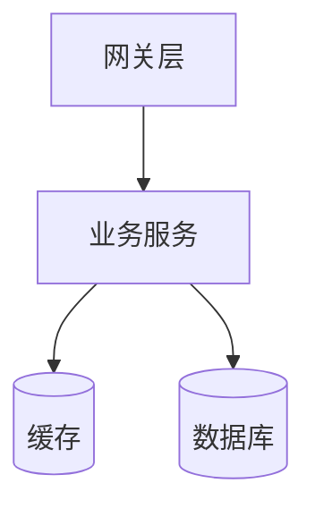
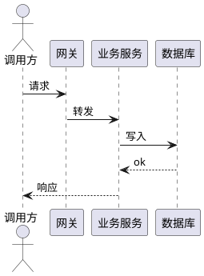
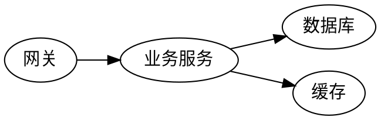

本页面向维护人员，说明 DemoModule 的总体架构、核心流程与质量要求。

<Info>维护前请先阅读[模块落地指导](/docs/DemoModule/latest/guide)，了解对外接口契约。</Info>

## 总体架构

## 设计原则

<CardGroup cols={2}>
  <Card title="单一职责" icon="target">每个子模块只负责一个清晰的能力边界。</Card>
  <Card title="可观测" icon="activity">关键路径埋点指标、日志、链路追踪三件套。</Card>
</CardGroup>

## 核心流程

<Steps>
  <Step title="接收请求">网关完成鉴权与限流后转发到业务服务。</Step>
  <Step title="处理与落库">业务服务执行校验、写入数据库并更新缓存。</Step>
  <Step title="返回结果">统一错误码与响应结构返回调用方。</Step>
</Steps>

## 常见维护操作

<AccordionGroup>
  <Accordion title="如何扩容？">
    调整副本数即可水平扩容，服务无状态。
  </Accordion>
  <Accordion title="如何排查慢请求？">
    查看链路追踪定位耗时阶段，再结合数据库慢查询日志分析。
  </Accordion>
</AccordionGroup>

<Warning>变更数据库 Schema 前必须经过评审并准备回滚脚本。</Warning>

## 渲染能力示例

[[toc]]

### 时序图（PlantUML）

### 依赖关系（Graphviz）

### GitHub 风格提示块

> [!NOTE]
> 这些提示块用 `> [!NOTE]`、`> [!WARNING]` 等写法，会自动渲染为 callout。

> [!CAUTION]
> 删除生产数据前务必二次确认。

### 数学公式

行内公式 $E = mc^2$，以及块级公式：

$$
P_{99} = \min\{x : F(x) \ge 0.99\}
$$

### 脚注

服务按无状态设计部署[^1]，便于水平扩容。

[^1]: 无状态指实例不保存会话数据，请求可被任意副本处理。
