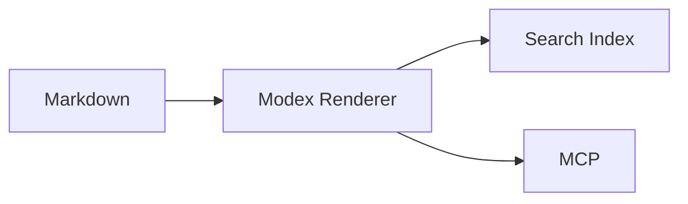
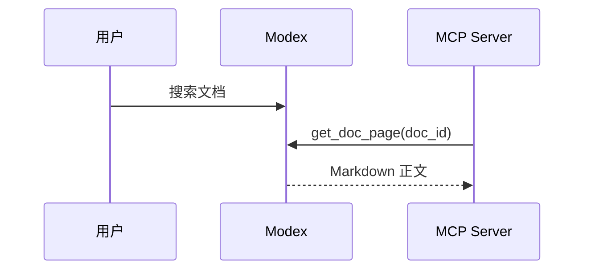
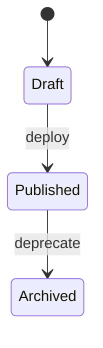
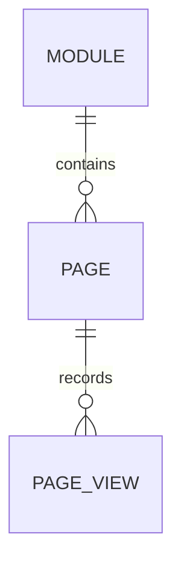
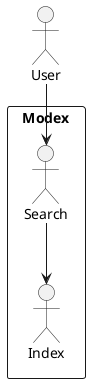

这篇文档是 Modex 文档系统的写作参考。它按能力列出当前支持的语法、适用场景和可复制案例。新文档可以先从这里找到相近写法，再替换为业务内容。

<Tip>
  推荐把普通说明写成标准 Markdown，把交互、提示、字段、代码组、图表等结构化内容写成 MDX 组件。这样搜索、MCP 阅读和右侧目录都更稳定。
</Tip>

## 支持能力总览

| 类别 | 支持内容 | 适合场景 |
| --- | --- | --- |
| 基础 Markdown | 标题、段落、强调、链接、引用、列表、表格、图片、分割线 | 普通说明、规范、FAQ |
| GFM | 删除线、任务列表、表格 | 迁移 GitHub/GitLab 文档 |
| 代码块 | 语言高亮、文件名、复制按钮、代码组 | 安装、配置、多平台示例 |
| 数学公式 | 行内公式、块级公式 | 性能模型、算法说明 |
| Mermaid | 流程图、时序图、状态图、ER 图、甘特图 | 常规图表，前端本地渲染 |
| Kroki 图表 | PlantUML、C4、Graphviz、D2、DBML、BPMN、WaveDrom 等 | UML、架构图、硬件/协议图 |
| MDX 组件 | Callout、Card、Tabs、Steps、Fields、Accordion、Frame 等 | 现代文档站体验 |
| API 文档 | 参数、响应、请求/响应示例、OpenAPI、Playground | 接口说明和调试 |
| 插件 | 管理台上传的组件插件、fenced code 插件 | 团队自定义渲染 |
| 复用片段 | Snippet、变量替换 | 统一警告、版本说明、公共模板 |

## Frontmatter 元数据

文档开头可以放 YAML frontmatter。Modex 会读取 `title`、`description`，并继续渲染正文。

```md
---
title: Threadpool 使用指南
description: 线程池参数、监控指标与故障排查说明。
---
```

## 标题与目录

`#` 到 `###` 会进入右侧目录。为了页面结构清晰，建议正文里从 `##` 开始分节，页面标题由系统标题承担。

```md
## 一级章节

### 子章节

#### 更深层标题
```

<Note>
  目录高亮跟随当前滚动位置，高亮颜色使用 Modex 主题色。标题文本会自动生成锚点，可以用普通链接跳转到 `#标题`。
</Note>

## 段落、强调和链接

普通段落直接书写。支持 **加粗**、*斜体*、~~删除线~~、`行内代码` 和 [普通链接](https://example.com)。

```md
业务线程池负责隔离 IO 任务。建议把 **核心路径** 与 *低优先级任务* 分开配置。
```

## 引用、分割线和转义

> 引用适合放规范原文、外部系统返回信息、告警说明或重要摘录。

---

如果需要展示 Markdown 控制字符，可以用反斜杠转义，例如 `\*不是斜体\*`。

## 列表

无序列表：

- 配置读取
- 参数校验
- 运行时监控

有序列表：

1. 创建文档目录
2. 编写 `docs.yaml`
3. 执行 `docsctl build`

任务列表：

- [x] 支持 GFM 任务项
- [x] 支持嵌套列表
- [ ] 发布前检查图片路径

## 表格

| 参数 | 类型 | 默认值 | 说明 |
| --- | --- | --- | --- |
| `coreSize` | number | `8` | 核心线程数 |
| `maxSize` | number | `32` | 最大线程数 |
| `queueSize` | number | `1000` | 等待队列长度 |

## 图片

图片支持远程 URL、站内绝对路径和相对路径。同步 Markdown 时，本地相对图片会被打包到文档资源目录。

```md


```

<Frame caption="Frame 可以给图片、视频、截图添加边框和说明">
  
</Frame>

## 普通代码块

代码块支持语言高亮、复制按钮和可选文件名。文件名写在语言后面的第一个 token。

```ts threadpool.ts
export const pool = createThreadPool({
  coreSize: 8,
  maxSize: 32,
  queueSize: 1000,
});
```

```yaml docs.yaml
module_key: RuntimeDocs
docs_version: latest
entries:
  - key: threadpool
    title: Threadpool
    type: markdown
    source: docs/threadpool.md
```

```diff
- maxSize: 16
+ maxSize: 32
```

```sql
select doc_id, count(*) as pv
from page_views
group by doc_id;
```

```delphi
type
  TWorkerPool<T> = class
  public
    procedure Submit(const Task: T);
  end;
```

## 多平台代码块

同一个功能在不同平台、框架或包管理器下写法不同时，使用 `CodeGroup`。

<CodeGroup>
  ```bash npm
  npm install @modex/docs
  ```

  ```bash pnpm
  pnpm add @modex/docs
  ```

  ```bash yarn
  yarn add @modex/docs
  ```

  ```bash bun
  bun add @modex/docs
  ```
</CodeGroup>

<CodeGroup>
  ```tsx Next.js
  import { ModexDocs } from "@modex/docs";

  export default function Page() {
    return <ModexDocs moduleKey="RuntimeDocs" />;
  }
  ```

  ```vue Vue
  <script setup lang="ts">
  import { ModexDocs } from "@modex/docs-vue";
  </script>

  <template>
    <ModexDocs module-key="RuntimeDocs" />
  </template>
  ```

  ```go Go
  client := modex.NewClient("https://modex.example.com")
  page, err := client.GetPage(ctx, "RuntimeDocs:latest:threadpool")
  ```

  ```python Python
  client = ModexClient("https://modex.example.com")
  page = client.get_page("RuntimeDocs:latest:threadpool")
  ```
</CodeGroup>

## 数学公式

行内公式使用 `$...$`：当缓存命中率为 $h$，平均延迟可以估算为 $T = hT_c + (1-h)T_s$。

块级公式使用 `$$...$$`：

$$
QPS = \frac{requests}{seconds}
$$

$$
P_{timeout} = 1 - e^{-\lambda t}
$$

## Callout 提示

<Note>普通注解：补充解释，不改变读者操作。</Note>
<Info>信息提示：给出背景、上下文或关联链接。</Info>
<Tip>技巧提示：推荐实践、快捷方式或经验值。</Tip>
<Warning>警告提示：标记可能导致错误结果的条件。</Warning>
<Danger>危险提示：标记破坏性操作、不可逆操作或安全风险。</Danger>
<Check>成功提示：说明校验通过、迁移完成或配置正确。</Check>

也可以用通用写法：

<Callout type="info">
  `Callout` 的 `type` 支持 `note`、`info`、`tip`、`warning`、`danger`、`check`。
</Callout>

## Card 和布局

<CardGroup cols={2}>
  <Card title="组件库" icon="boxes" href="#mdx-组件清单">
    查看当前可直接书写的全部 MDX 组件。
  </Card>
  <Card title="图表" icon="workflow" href="#mermaid-图表">
    Mermaid、PlantUML、C4、Graphviz、D2 等图表示例。
  </Card>
  <Card title="公式" icon="sigma" href="#数学公式">
    行内公式和块级公式示例。
  </Card>
  <Card title="插件" icon="plug" href="#上传插件示例">
    组件插件和 fenced code 插件的接入形式。
  </Card>
</CardGroup>

<Columns cols={3}>
  <Card title="轻量" icon="feather">用于短说明和局部指引。</Card>
  <Card title="结构化" icon="layout">用于入口、场景和能力分组。</Card>
  <Card title="可跳转" icon="arrow-right">带 `href` 时可作为链接卡片。</Card>
</Columns>

## Steps 步骤

<Steps>
  <Step title="准备文档目录">
    在仓库中创建 `docs/` 或 `content/docs/`。
  </Step>
  <Step title="编写配置">
    声明文档源、构建方式、版本、入口和发布 token。
  </Step>
  <Step title="发布到 Modex">
    在 CI 中执行 `docsctl build && docsctl package && docsctl deploy`。
  </Step>
</Steps>

## Tabs 标签页

<Tabs>
  <Tab title="Markdown">
    普通 `.md` 文件适合从历史仓库平滑迁移。
  </Tab>
  <Tab title="MDX">
    `.mdx` 文件适合直接书写组件、交互示例和复杂布局。
  </Tab>
  <Tab title="静态站">
    VitePress、VuePress、Fumadocs 可以保留原站点体验，并纳入搜索与 MCP。
  </Tab>
</Tabs>

## Accordion 和 Expandable

<AccordionGroup>
  <Accordion title="支持上传插件吗？">
    支持。管理员可以在「插件管理」里上传组件插件或 fenced code 插件。
  </Accordion>
  <Accordion title="普通 Markdown 会不会因为 JSX 失败？">
    渲染器会先按 MDX 编译，失败后回退到普通 Markdown。
  </Accordion>
</AccordionGroup>

<Expandable title="高级配置项">
  <ParamField path="DOCS_BUILDER" type="string" default="markdown">
    可选 `markdown`、`vitepress`、`vuepress`、`fumadocs`。
  </ParamField>
  <ParamField path="DOCS_OUTPUT" type="string">
    静态站构建产物目录，例如 `docs/.vitepress/dist`。
  </ParamField>
</Expandable>

## 字段说明

`ParamField` 适合描述请求参数、配置项、环境变量。

<ParamField path="module_key" type="string" required>
  文档源唯一标识。建议使用稳定英文名。
</ParamField>

<ParamField query="version" type="string" default="latest">
  查询指定文档版本。
</ParamField>

<ParamField header="X-Modex-Deploy-Token" type="string" required>
  CI 发布文档包时使用的部署 token。
</ParamField>

<ParamField body="entries[].source" type="string">
  文档入口对应的源文件或源目录。
</ParamField>

`ResponseField` 适合描述响应字段。

<ResponseField name="doc_id" type="string" required>
  MCP 与搜索系统读取页面时使用的稳定 ID。
</ResponseField>

<ResponseField name="content_md" type="string">
  Markdown 原文，供 Modex 自渲染、搜索与 MCP 使用。
</ResponseField>

<Response>
  `Response` 可以包裹一组响应字段或响应结构说明。
</Response>

## API 示例

<RequestExample>

```json
{
  "query": "Threadpool 如何配置",
  "mode": "hybrid",
  "page_size": 10
}
```

</RequestExample>

<ResponseExample>

```json
{
  "total": 1,
  "results": [
    { "title": "Threadpool", "doc_id": "RuntimeDocs:latest:threadpool" }
  ]
}
```

</ResponseExample>

## API Playground

`ApiPlayground` 会渲染一个可编辑的请求面板。适合内网测试接口或演示 API 入参。

<ApiPlayground
  title="搜索接口示例"
  method="POST"
  url="https://example.com/api/search"
  headers={{"Content-Type": "application/json"}}
  body={{"query": "threadpool", "mode": "keyword"}}
/>

## OpenAPI

`OpenApi` 可以从 JSON OpenAPI 规范渲染单个 operation。需要在组件上指定 `spec` 和 `operation`，或在插件配置里指定默认 spec 地址。

```mdx
<OpenApi spec="https://example.com/openapi.json" operation="GET /api/docs/{doc_id}" />
```

## Mermaid 图表

流程图：



可点击节点：


时序图：



状态图：



ER 图：



## Kroki UML 和图表

PlantUML：



C4 PlantUML：

说明：C4 图没有自动钻取到子图的协议，但 C4-PlantUML 元素通常可以通过 `$link` 参数手动挂页面链接，用来跳到更细的容器图、组件图或对应文档页。

```c4
@startuml
!include <C4/C4_Context>
Person(user, "Reader")
System(modex, "Modex", "Documentation platform", $link="/me/docs-example")
Rel(user, modex, "Reads docs")
@enduml
```

Graphviz / DOT：


D2：

```d2
docs -> renderer -> search
renderer -> mcp
```

DBML：

```dbml
Table pages {
  id varchar [primary key]
  doc_id varchar
  title varchar
}
```

支持的 Kroki fenced code language 包括：`plantuml`、`puml`、`uml`、`c4`、`graphviz`、`dot`、`ditaa`、`blockdiag`、`seqdiag`、`actdiag`、`nwdiag`、`packetdiag`、`rackdiag`、`bpmn`、`bytefield`、`excalidraw`、`nomnoml`、`pikchr`、`structurizr`、`svgbob`、`vega`、`vegalite`、`vega-lite`、`wavedrom`、`wireviz`、`d2`、`dbml`、`erd`。

## 文件树

可以用普通列表配合 `Tree` 展示目录结构。

<Tree>
  - docs
    - index.md
    - threadpool.md
    - assets
      - threadpool.png
  - docs.yaml
  - cbb.toml
</Tree>

也可以用组件写法：

<Tree>
  <Folder name="content">
    <Folder name="docs">
      <File name="index.mdx" />
      <File name="api.mdx" />
    </Folder>
  </Folder>
</Tree>

## 行内组件

支持悬浮解释 <Tooltip tip="Model Context Protocol">MCP</Tooltip>、徽标 <Badge>Beta</Badge>、颜色徽标 <Badge color="green">Stable</Badge>、<Badge color="red">Deprecated</Badge>、<Badge color="blue">Preview</Badge>、色板 <Color>#2f855a</Color> 和图标 <Icon icon="book-open" />。

## Panel、Update、Banner

<Panel>
  `Panel` 适合放补充说明、限制条件、迁移注意事项或局部背景。
</Panel>

<Update label="2026.06" description="文档系统增强">
  新增右侧目录高亮、反馈落库、相对图片路径修复和多平台代码组示例。
</Update>

<Banner>
  发布前请确认图片、代码块、公式和图表都能在预览环境正常渲染。
</Banner>

## Snippet 复用片段

管理员可以在「复用片段」里维护公共内容。文档中用 `Snippet` 引用：

```mdx
<Snippet name="common/warning" />
```

如果片段不存在，默认不会阻塞页面渲染。

## 上传插件示例

组件插件：管理员上传组件插件后，可以像普通 MDX 标签一样使用。

```mdx
<StatusMatrix service="docs-api" />
```

fenced code 插件：管理员上传 fenced code 插件后，可以用自定义语言触发。

````md
```timeline
2026-06-16: 文档系统支持插件渲染
```
````

## 原始 HTML

普通 Markdown 模式下支持安全范围内的 HTML。导入历史 Markdown 时，`<br/>`、表格片段等会尽量保留。

<br/>

<span>这是一段 HTML span 内容。</span>

## 写作建议

- 一页只表达一个主题，超过三屏时用二级标题拆分。
- 能用标准 Markdown 就不要写复杂 JSX。
- 多平台安装、配置、API 示例统一用 `CodeGroup`。
- 架构图优先用 Mermaid；复杂 UML 或 C4 用 Kroki。
- 图片放在当前文档附近的 `assets/` 目录，使用相对路径。
- 关键配置和接口字段用 `ParamField` / `ResponseField`，方便扫描。

## MDX 组件清单

当前内置组件包括：

| 组件 | 用途 |
| --- | --- |
| `Note` / `Info` / `Tip` / `Warning` / `Danger` / `Check` / `Callout` | 提示框 |
| `Card` / `CardGroup` / `Columns` / `Tile` | 卡片和多列布局 |
| `Tabs` / `Tab` | 标签页 |
| `CodeGroup` | 多平台代码组 |
| `Steps` / `Step` | 步骤流程 |
| `Accordion` / `AccordionGroup` / `Expandable` | 折叠内容 |
| `ParamField` / `ResponseField` / `Field` / `Response` | 字段说明 |
| `ApiPlayground` / `RequestExample` / `ResponseExample` / `OpenApi` | API 文档 |
| `Frame` / `Panel` / `Update` / `Banner` / `Snippet` | 媒体、面板、更新、片段 |
| `Tooltip` / `Badge` / `Color` / `Icon` | 行内增强 |
| `Tree` / `Folder` / `File` | 文件树 |
| `Mermaid` | Mermaid 组件写法 |

## Markdown 源码模板

下面是一份最小模板，可直接复制到新文档：

````md
---
title: 页面标题
description: 页面摘要。
---

## 背景

说明本文要解决的问题。

## 快速开始

<CodeGroup>
  ```bash npm
  npm install your-package
  ```

  ```bash pnpm
  pnpm add your-package
  ```
</CodeGroup>

## 配置项

<ParamField path="token" type="string" required>
  调用接口所需的 token。
</ParamField>

## 流程


````
