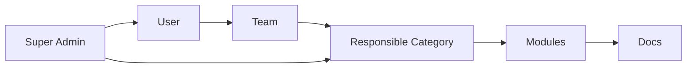

# Modex 项目指南

<Banner>
Modex 是一个正式的团队文档体验平台：负责把工程文档从仓库接入、发布、检索、阅读、治理，并通过 MCP 提供给 AI 工具使用。
</Banner>

## 适用场景

<CardGroup cols={2}>
  <Card title="团队文档中心" icon="BookOpen">
    把分散在多个仓库、多个框架里的工程文档统一发布到一个入口。
  </Card>
  <Card title="AI 可检索知识库" icon="Sparkles">
    让 Claude Code、Cursor、Windsurf 等工具通过 MCP 读取团队实时文档。
  </Card>
  <Card title="文档治理后台" icon="ShieldCheck">
    使用分类、团队、负责人和权限模型维护文档归属。
  </Card>
  <Card title="CI 驱动发布" icon="GitBranch">
    文档仓库在自己的流水线里构建，再把标准 artifact 推送到 Modex。
  </Card>
</CardGroup>

## 系统组成

<CardGroup cols={2}>
  <Card title="backend" icon="Server">
    Go REST API，负责认证会话、权限、文档发布接收、搜索索引、阅读统计和运维健康检查。
  </Card>
  <Card title="frontend" icon="BookOpen">
    Next.js 门户，提供文档阅读、MDX 渲染、搜索问答、用户入口、管理控制台和国际化界面。
  </Card>
  <Card title="tools/docsctl" icon="Package">
    文档仓库侧 CLI，负责 validate、build、package、deploy，把不同文档框架统一成 Modex artifact。
  </Card>
  <Card title="mcp" icon="Terminal">
    面向 AI 工具的 MCP server、npx 包和 Modex Skill，让 Claude Code、Cursor 等客户端读取平台文档。
  </Card>
</CardGroup>

## 快速启动

<Tabs>
  <Tab title="Docker Compose">

```bash
cd deploy
cp .env.example .env
docker compose up --build
```

打开：

- 前端：`http://localhost:3456`
- 后端健康检查：`http://localhost:8671/healthz`
- MinIO Console：`http://localhost:9001`

  </Tab>
  <Tab title="本地开发">

```bash
cd backend
go run ./cmd/modex-api
```

```bash
cd frontend
npm install
npm run dev
```

  </Tab>
</Tabs>

## 发布流程

<Steps>
  <Step title="在后台创建文档源">
    选择文档框架、归属分类和负责团队，然后生成 Deploy Token。
  </Step>
  <Step title="在文档仓库构建">
    VuePress、VitePress、Fumadocs 等框架仍在源仓库自己的 CI 环境中构建。
  </Step>
  <Step title="用 docsctl 打包">
    `docsctl package` 会生成包含 `metadata.json`、`manifest.json`、`documents.jsonl`、`nav.json` 和 `site/` 的标准 zip。
  </Step>
  <Step title="推送到 Modex">
    `docsctl deploy` 将 artifact 上传到 `/api/deploy`，并携带 `X-Modex-Deploy-Token`。
  </Step>
  <Step title="自动归档和索引">
    后端解析 artifact，写入模块、版本、条目、页面、导航和静态资源，并清理该版本旧 embedding。
  </Step>
</Steps>

<CodeGroup>

```bash docsctl
DOCS_SOURCE_DIR=/path/to/docs go run ./cmd/docsctl validate
DOCS_SOURCE_DIR=/path/to/docs go run ./cmd/docsctl build
DOCS_SOURCE_DIR=/path/to/docs go run ./cmd/docsctl package
DOCS_DEPLOY_URL=http://localhost:8671/api/deploy \
DOCS_DEPLOY_TOKEN=your-token \
DOCS_ARTIFACT=/path/to/docs/.modex/docs-artifact.zip \
go run ./cmd/docsctl deploy
```

```yaml GitLab CI
include:
  - remote: "https://raw.githubusercontent.com/songkwon/modex/main/deploy/ci/modex-docs.gitlab-ci.yml"

variables:
  MODEX_MODULE_KEY: "rd-doc"
  DOCS_BUILDER: "vitepress"
  DOCS_BUILD: "npm ci && npm run docs:build"
  DOCS_OUTPUT: "docs/.vitepress/dist"
  MODEX_DEPLOY_URL: "https://modex.example.com/api/deploy"
  # MODEX_DEPLOY_TOKEN: set in CI/CD Variables, masked and protected
```

</CodeGroup>

## 发布诊断

部署失败时，后端会返回阶段化报告。CI 日志里可以直接看到失败发生在哪一步。

<ResponseField name="deploy.stages" type="array">
发布阶段列表，包含 `parse_artifact`、`authenticate`、`upload_assets`、`clear_embeddings`、`ingest_metadata`。
</ResponseField>

<RequestExample>

```json
{
  "error": {
    "code": "invalid_deploy_token",
    "message": "deploy token required or invalid for this module"
  },
  "deploy": {
    "stages": [
      { "name": "parse_artifact", "status": "ok" },
      { "name": "authenticate", "status": "failed", "error": "deploy token mismatch" }
    ]
  }
}
```

</RequestExample>

## MCP 接入

每个用户在个人页生成自己的 MCP Token，然后把 Modex 接入 AI 客户端。

```bash
claude mcp add modex \
  --env MODEX_API_BASE_URL=https://modex.example.com \
  --env MODEX_MCP_TOKEN=your-token \
  -- npx -y modex-mcp
```

<Note>
MCP Token 是个人凭证。服务端会记录 MCP 调用日志，用于追踪 AI 工具读取文档的行为。
</Note>

## 搜索和 AI 问答

<Columns cols={3}>
  <Panel>
    **关键词搜索**

    适合标题、术语、错误码和 API 名称。
  </Panel>
  <Panel>
    **语义搜索**

    适合自然语言问题和概念召回。
  </Panel>
  <Panel>
    **混合搜索**

    默认推荐模式，结合关键词命中和向量相似度。
  </Panel>
</Columns>

## 权限模型



- 超级管理员管理所有用户、团队、分类、模型和平台配置。
- 团队成员可以管理自己团队负责分类下的文档源和发布记录。
- 文档阅读默认开放给登录用户或匿名访客，取决于部署侧策略。

## 运维检查

`GET /healthz` 会返回轻量运维快照：

<ParamField name="dependencies.repository.configured" type="boolean">
是否启用了持久化 repository。
</ParamField>

<ParamField name="dependencies.object_storage.mode" type="string">
静态资源存储模式，可能是 `minio` 或 `memory`。
</ParamField>

<ParamField name="dependencies.search.embedding_count" type="number">
当前缓存或外部向量库中的 embedding 数量。
</ParamField>

## 国际化

前端翻译文件位于：

```text
frontend/messages/zh-CN.json
frontend/messages/en-US.json
```

<Warning>
`unmigrated.*` key 是自动提取出来的待迁移文案池。它们确保 Weblate 能先看到完整词条，后续可以逐页把代码里的硬编码文案替换为语义化 key。
</Warning>

## 测试

```bash
cd backend && go test ./...
cd tools/docsctl && go test ./...
cd mcp && go test ./...

cd frontend
npm run lint
npm run build
npm run e2e
```

## 生产建议

<Check>
使用 `AUTH_MODE=oidc`、开启安全 cookie、配置真实模型提供商、接入备份恢复，并把所有 token 放在 secret manager 或 CI secret variables 中。
</Check>

<Danger>
不要公开 `deploy/.env`、`deploy/config.yaml` 或 `docker compose config` 输出。这些内容可能包含 OIDC、数据库、MinIO、PostHog 或 Deploy Token 等敏感信息。
</Danger>
