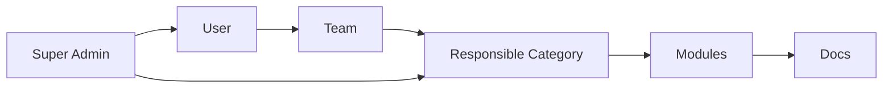

# Modex 项目指南

<Banner>
Modex 是一个正式的团队文档体验平台：负责把工程文档从仓库接入、发布、检索、阅读、治理，并通过 MCP 提供给 AI 工具使用。
</Banner>

## 适用场景

<CardGroup cols={2}>
  <Card title="团队文档中心" icon="BookOpen">
    把分散在多个仓库、多个框架里的工程文档统一发布到一个入口。
  </Card>
  <Card title="AI 可检索知识库" icon="Sparkles">
    让 Claude Code、Cursor、Windsurf 等工具通过 MCP 读取团队实时文档。
  </Card>
  <Card title="文档治理后台" icon="ShieldCheck">
    使用分类、团队、负责人和权限模型维护文档归属。
  </Card>
  <Card title="CI 驱动发布" icon="GitBranch">
    文档仓库在自己的流水线里构建，再把标准 artifact 推送到 Modex。
  </Card>
</CardGroup>

## 系统组成

<CardGroup cols={2}>
  <Card title="backend" icon="Server">
    Go REST API，负责认证会话、权限、文档发布接收、搜索索引、阅读统计和运维健康检查。
  </Card>
  <Card title="frontend" icon="BookOpen">
    Next.js 门户，提供文档阅读、MDX 渲染、搜索问答、用户入口、管理控制台和国际化界面。
  </Card>
  <Card title="tools/docsctl" icon="Package">
    文档仓库侧 CLI，负责 validate、build、package、deploy，把不同文档框架统一成 Modex artifact。
  </Card>
  <Card title="mcp" icon="Terminal">
    面向 AI 工具的 MCP server、npx 包和 Modex Skill，让 Claude Code、Cursor 等客户端读取平台文档。
  </Card>
</CardGroup>

## 快速启动

<Tabs>
  <Tab title="Docker Compose">

```bash
cd deploy
cp .env.example .env
docker compose up --build
```

打开：

- 前端：`http://localhost:3456`
- 后端健康检查：`http://localhost:8671/healthz`
- MinIO Console：`http://localhost:9001`

  </Tab>
  <Tab title="本地开发">

```bash
cd backend
go run ./cmd/modex-api
```

```bash
cd frontend
npm install
npm run dev
```

  </Tab>
</Tabs>

## 发布流程

<Steps>
  <Step title="在后台创建文档源">
    到「管理控制台 / 文档源管理」创建文档源，选择框架、归属分类和负责团队，然后复制 Deploy Token。
  </Step>
  <Step title="在文档仓库配置 CI">
    把 Deploy Token 保存为 GitLab CI 变量 `MODEX_DEPLOY_TOKEN`，并 include Modex 提供的 CI 模板。
  </Step>
  <Step title="推送默认分支">
    CI 会运行 `docsctl deploy`。这个命令会自动 validate、build、package、upload，用户不需要手动串多个步骤。
  </Step>
  <Step title="自动归档和索引">
    后端解析 artifact，写入模块、版本、条目、页面、导航和静态资源，并清理该版本旧 embedding。
  </Step>
</Steps>

## docsctl 使用方式

docsctl 的目标是把接入做简单：本地调试时一条命令，生产环境由 GitLab CI 自动执行同一条命令。

<CodeGroup>

```bash 本地调试
docsctl deploy \
  --source /path/to/docs \
  --version latest \
  --deploy-url https://modex.example.com/api/deploy \
  --token "$MODEX_DEPLOY_TOKEN"
```

```yaml GitLab CI
include:
  - project: "songkwon/modex-fscut"
    ref: "main"
    file: "deploy/ci/modex-docs.gitlab-ci.yml"

variables:
  MODEX_DEPLOY_URL: "https://modex.example.com/api/deploy"

# MODEX_DEPLOY_TOKEN 在 GitLab Settings > CI/CD > Variables 中配置，设为 Masked + Protected。
```

</CodeGroup>

<CardGroup cols={2}>
  <Card title="直接支持" icon="Package">
    `markdown`、`vitepress`、`vuepress`、`fumadocs`、`docusaurus`、`mkdocs`、`honkit`、`gitbook`、`static`。
  </Card>
  <Card title="通用静态站" icon="Globe">
    其他框架只要能产出 HTML 静态目录，都可以用 `DOCS_BUILDER=static` 接入。
  </Card>
</CardGroup>

<Note>
部署前先在 Modex 后台创建文档源并复制该文档源的 Deploy Token。同步时后端会通过 token 找到对应文档源和挂载点，不需要在 CI 里再填写内部标识。
</Note>

### 构建失败怎么排查

docsctl 会把构建日志实时输出，并在失败时汇总以下信息：

- 失败的 entry key 和框架类型；
- 实际执行的构建命令和工作目录；
- 进程退出码；
- 自动注入的 `DOCS_BASE`；
- 最后一段构建日志和排查建议。

```text
docsctl build failed during build: documentation build failed
  entry: guide (vitepress)
  command: npm ci && npm run docs:build
  working directory: /workspace/docs
  exit code: 1
  base path: DOCS_BASE=/api/docs/rd-doc/latest/guide/site/
  last output:
    Error: Cannot find module ...
```

### 文档 Base 自动处理

编译静态站时，docsctl 会自动注入 `DOCS_BASE`、`MODEX_DOCS_BASE`、`VITEPRESS_BASE` 和 `BASE_URL`。构建完成后，它还会扫描 HTML、CSS 和 Web Manifest/JSON，把确实指向构建目录内文件的根路径引用自动改成 Modex 文档地址，例如：

```text
/assets/app.js
→ /api/docs/rd-doc/latest/guide/site/assets/app.js
```

不存在的文件、站内业务路由和 `//cdn.example.com/...` 不会改写。框架配置仍建议优先读取 `DOCS_BASE`；如项目有特殊路由规则，可设置 `DOCS_REWRITE_BASE=0` 关闭构建后改写。

## 发布诊断

部署失败时，后端会返回阶段化报告。CI 日志里可以直接看到失败发生在哪一步。

<ResponseField name="deploy.stages" type="array">
发布阶段列表，包含 `parse_artifact`、`authenticate`、`upload_assets`、`clear_embeddings`、`ingest_metadata`。
</ResponseField>

<RequestExample>

```json
{
  "error": {
    "code": "invalid_deploy_token",
    "message": "deploy token required or invalid for this module"
  },
  "deploy": {
    "stages": [
      { "name": "parse_artifact", "status": "ok" },
      { "name": "authenticate", "status": "failed", "error": "deploy token mismatch" }
    ]
  }
}
```

</RequestExample>

## MCP 接入

每个用户在个人页生成自己的 MCP Token，然后把 Modex 接入 AI 客户端。

```bash
claude mcp add modex \
  --env MODEX_API_BASE_URL=https://modex.example.com \
  --env MODEX_MCP_TOKEN=your-token \
  -- npx -y https://modex.example.com/api/mcp/dist/modex-mcp.tgz
```

<Note>
MCP Token 是个人凭证。服务端会记录 MCP 调用日志，用于追踪 AI 工具读取文档的行为。
</Note>

## 搜索和 AI 问答

<Columns cols={3}>
  <Panel>
    **关键词搜索**

    适合标题、术语、错误码和 API 名称。
  </Panel>
  <Panel>
    **语义搜索**

    适合自然语言问题和概念召回。
  </Panel>
  <Panel>
    **混合搜索**

    默认推荐模式，结合关键词命中和向量相似度。
  </Panel>
</Columns>

## 权限模型



- 超级管理员管理所有用户、团队、分类、模型和平台配置。
- 团队成员可以管理自己团队负责分类下的文档源和发布记录。
- 文档阅读默认开放给登录用户或匿名访客，取决于部署侧策略。

## 运维检查

`GET /healthz` 会返回轻量运维快照：

<ParamField name="dependencies.repository.configured" type="boolean">
是否启用了持久化 repository。
</ParamField>

<ParamField name="dependencies.object_storage.mode" type="string">
静态资源存储模式，可能是 `minio` 或 `memory`。
</ParamField>

<ParamField name="dependencies.search.embedding_count" type="number">
当前缓存或外部向量库中的 embedding 数量。
</ParamField>

## 国际化

前端翻译文件位于：

```text
frontend/messages/zh-CN.json
frontend/messages/en-US.json
```

<Warning>
`unmigrated.*` key 是自动提取出来的待迁移文案池。它们确保 Weblate 能先看到完整词条，后续可以逐页把代码里的硬编码文案替换为语义化 key。
</Warning>

## 测试

```bash
cd backend && go test ./...
cd tools/docsctl && go test ./...
cd mcp && go test ./...

cd frontend
npm run lint
npm run build
npm run e2e
```

## 生产建议

<Check>
使用 `AUTH_MODE=oidc`、开启安全 cookie、配置真实模型提供商、接入备份恢复，并把所有 token 放在 secret manager 或 CI secret variables 中。
</Check>

<Danger>
不要公开 `deploy/.env`、`deploy/config.yaml` 或 `docker compose config` 输出。这些内容可能包含 OIDC、数据库、MinIO、PostHog 或 Deploy Token 等敏感信息。
</Danger>
